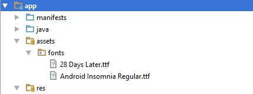
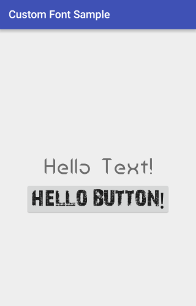

## About the Library
CustomFontLib is an Android Library to help adding custom fonts to Android Views.

## How to use
### 1. Add the lib as a dependency to your project build.gradle:
```groovy
dependencies {
    compile 'com.daniribalbert:custom-font-lib:0.9.9'
}
```

### 2. Add the fonts to the _assets/fonts_ folder:


### 3. Add the custom font view to your layout:
```xml
<RelativeLayout
    xmlns:android="http://schemas.android.com/apk/res/android"
    xmlns:app="http://schemas.android.com/apk/res-auto"
    ... (Additional attributes) />
```
```xml
    <com.daniribalbert.customfontlib.views.CustomFontTextView
        android:id="@+id/text"
        android:layout_width="wrap_content"
        android:layout_height="wrap_content"
        android:text="Hello Text!"
        app:font="your_font_name"/>
```
Use the _font_ attribute to add your font name **without extension** ex: `app:font="helvetica"`.



For more information please check the sample app available at [GitHub][1]

## License

    Copyright (c) 2016 daniribalbert
		
    Permission is hereby granted, free of charge, to any person obtaining a copy of this software
    and associated documentation files (the "Software"), to deal in the Software without
    restriction, including without limitation the rights to use, copy, modify, merge, publish,
    distribute, sublicense, and/or sell copies of the Software, and to permit persons to whom the
    Software is furnished to do so, subject to the following conditions:
		
    The above copyright notice and this permission notice shall be included in all copies or
    substantial portions of the Software.
		
    THE SOFTWARE IS PROVIDED "AS IS", WITHOUT WARRANTY OF ANY KIND, EXPRESS OR IMPLIED, INCLUDING
    BUT NOT LIMITED TO THE WARRANTIES OF MERCHANTABILITY, FITNESS FOR A PARTICULAR PURPOSE AND
    NONINFRINGEMENT. IN NO EVENT SHALL THE AUTHORS OR COPYRIGHT HOLDERS BE LIABLE FOR ANY CLAIM,
    DAMAGES OR OTHER LIABILITY, WHETHER IN AN ACTION OF CONTRACT, TORT OR OTHERWISE, ARISING FROM,
    OUT OF OR IN CONNECTION WITH THE SOFTWARE OR THE USE OR OTHER DEALINGS IN THE SOFTWARE.

[1]: https://github.com/daniribalbert/CustomFontLib/tree/master/app